# TryHackMe - Tomghost Writeup

<p align="center">
  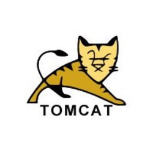
</p>

## Overview

Tomghost is an easy Linux machine that focuses on service enumeration, exploiting the Ghostcat vulnerability (CVE-2020-1938), credential harvesting, GPG key abuse, and privilege escalation through a misconfigured sudo rule.

The attack path begins with identifying an exposed Apache JServ Protocol (AJP) service, exploiting Ghostcat to disclose sensitive files, recovering user credentials, decrypting protected files using a cracked GPG key passphrase, and finally escalating privileges to root through a GTFOBins technique involving the `zip` utility.

## Reconnaissance

### Nmap Scan

The first step was to identify the exposed services running on the target machine.

```bash
nmap -sC -sV -T4 -A <TARGET_IP>
```

**Figure 1: Nmap Scan Results**

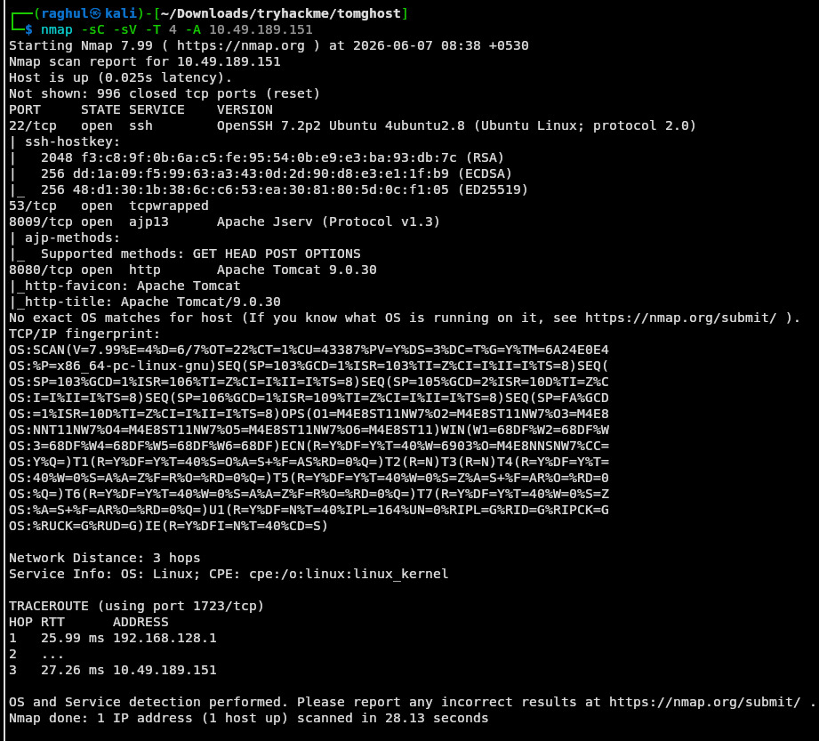

The scan revealed three interesting services:

| Port | Service                     |
| ---- | --------------------------- |
| 22   | SSH                         |
| 8009 | Apache JServ Protocol (AJP) |
| 8080 | Apache Tomcat 9.0.30        |

The presence of AJP on port 8009 immediately stood out because it is not commonly exposed externally and has historically been affected by several security issues.

---

## Web Enumeration

Browsing to port 8080 revealed the default Apache Tomcat page.

**Figure 2: Apache Tomcat Default Page**

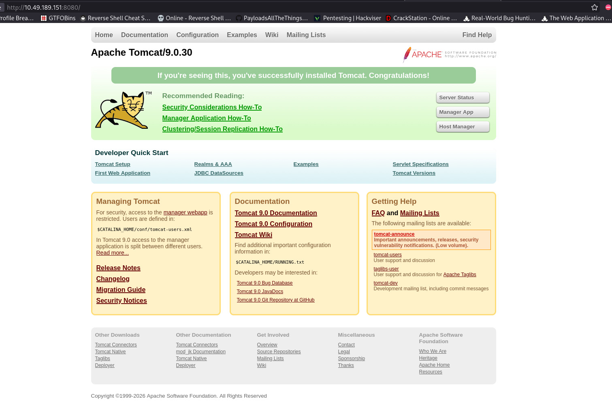

The page itself did not provide any obvious attack surface, but it confirmed the Tomcat version discovered during enumeration.

At this point, the AJP service on port 8009 appeared to be the most promising attack vector.

---

## Investigating AJP

While researching Apache JServ Protocol (AJP), I came across information regarding Ghostcat (CVE-2020-1938), a file inclusion vulnerability affecting vulnerable Apache Tomcat installations.

Reference used during research:

https://blog.qualys.com/product-tech/2020/03/10/detect-apache-tomcat-ajp-file-inclusion-vulnerability-cve-2020-1938-using-qualys-was

**Figure 3: Ghostcat Vulnerability Research**

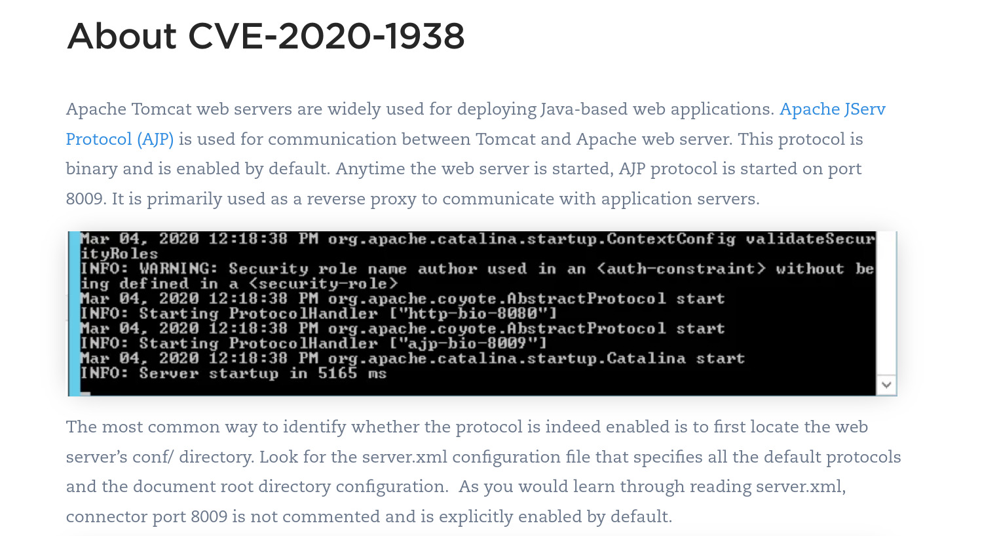

Ghostcat allows an attacker to read files from the server through the AJP connector when the service is exposed and improperly configured.

This vulnerability matched the environment discovered during enumeration, making it the logical next step.

---

## Exploiting Ghostcat (CVE-2020-1938)

### Discovering an Exploit

I launched Metasploit and searched for Ghostcat-related modules.

```bash
msfconsole
search ghostcat
```

**Figure 4: Ghostcat Module Discovery**

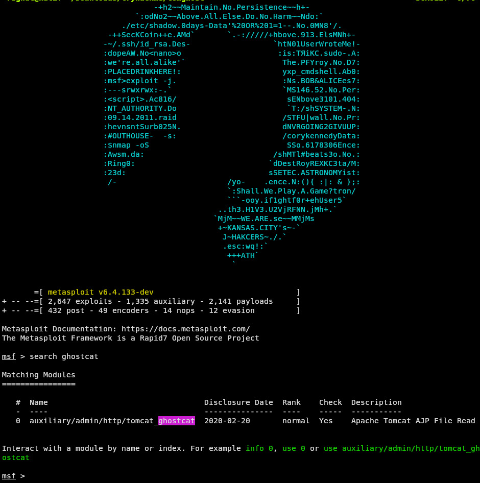

Metasploit returned an auxiliary module capable of exploiting the Apache Tomcat AJP File Read vulnerability.

The module automatically targeted port 8009, which matched the exposed AJP service identified earlier.

---

### Retrieving Sensitive Files

The Ghostcat module was configured and executed.

```bash
use auxiliary/admin/http/tomcat_ghostcat
set RHOSTS <TARGET_IP>
run
```

**Figure 5: Sensitive File Disclosure**

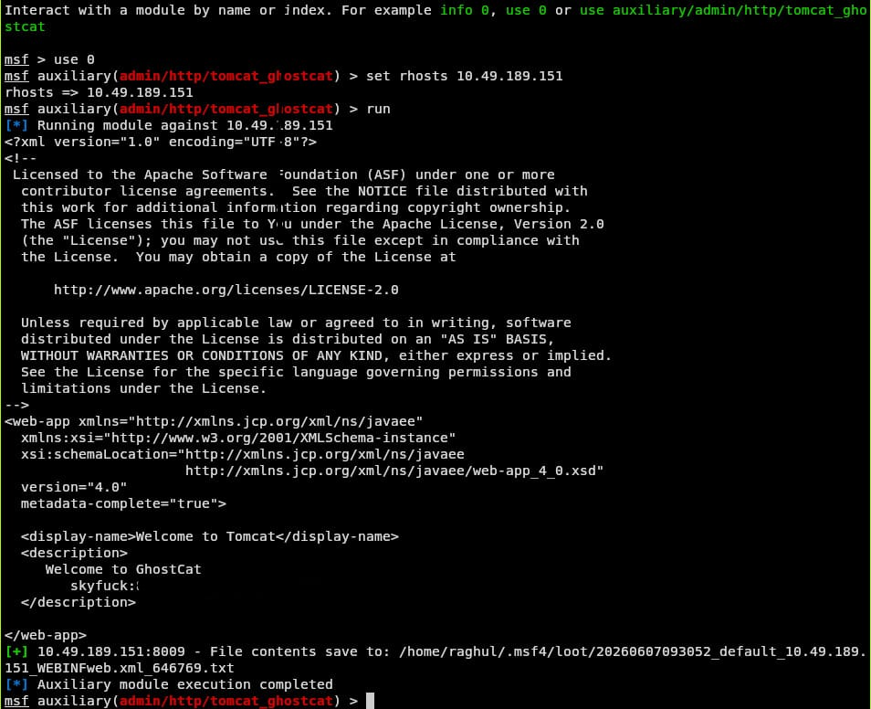

The exploit successfully disclosed application files containing user credentials.

> Note: The machine contains a username that is a derogatory term. The name is preserved in this writeup only because it is part of the original TryHackMe room.

Among the disclosed information were credentials belonging to a user named `skyfuck`.

This provided the first foothold on the target machine.

---

## Initial Access

Using the recovered credentials, SSH access was obtained.

```bash
ssh skyfuck@<TARGET_IP>
```

**Figure 6: SSH Access as Skyfuck**

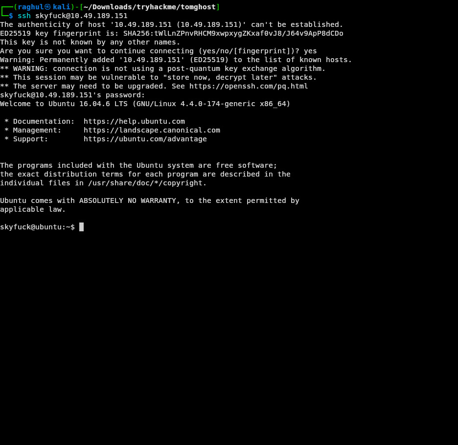

After logging in, I began enumerating the user's home directory for additional credentials, keys, or sensitive files.

## Credential Harvesting

### Discovering Encrypted Files

While enumerating Skyfuck's home directory, I discovered two interesting files:

```text
tryhackme.asc
credential.pgp
```

The `.asc` file appeared to be a GPG private key, while the `.pgp` file contained encrypted data.

To analyze them further, I copied both files to my attacking machine using SCP.

```bash
scp skyfuck@<TARGET_IP>:/home/skyfuck/tryhackme.asc .
scp skyfuck@<TARGET_IP>:/home/skyfuck/credential.pgp .
```

**Figure 7: Downloading Sensitive Files**


---

### Cracking the GPG Passphrase

The private key appeared to be password protected.

To recover the passphrase, I converted the key into a format compatible with John the Ripper.

```bash
gpg2john tryhackme.asc > hash.txt
john --wordlist=/usr/share/wordlists/rockyou.txt hash.txt
```

**Figure 8: Recovering the Private Key Passphrase**

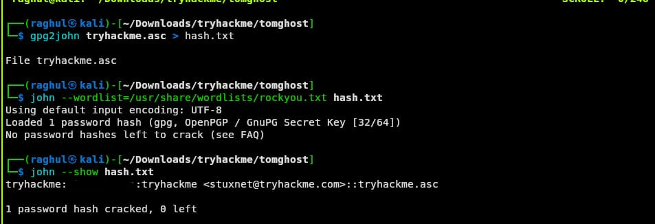

John successfully recovered the passphrase protecting the private key.

This allowed me to proceed with decrypting the encrypted credential file.

---

### Decrypting credential.pgp

After importing the private key, I decrypted the encrypted file.

```bash
gpg --import tryhackme.asc
gpg --decrypt credential.pgp
```

**Figure 9: Recovering Merlin's Credentials**

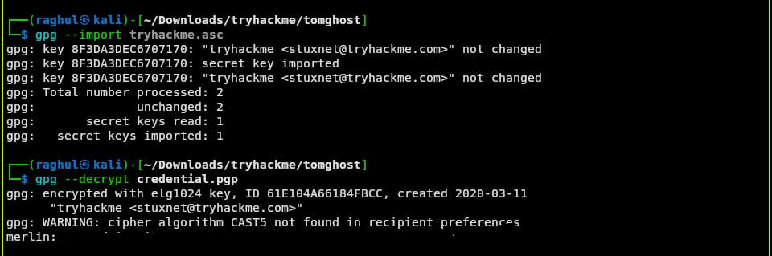

The decrypted file revealed credentials belonging to another user named `merlin`.

These credentials provided a path to the next stage of the compromise.

---

## User Access

Using the recovered credentials, I established an SSH session as Merlin.

```bash
ssh merlin@<TARGET_IP>
```

After successfully logging in, the user flag was retrieved.

```bash
cat user.txt
```

**Figure 10: User Flag Retrieved**

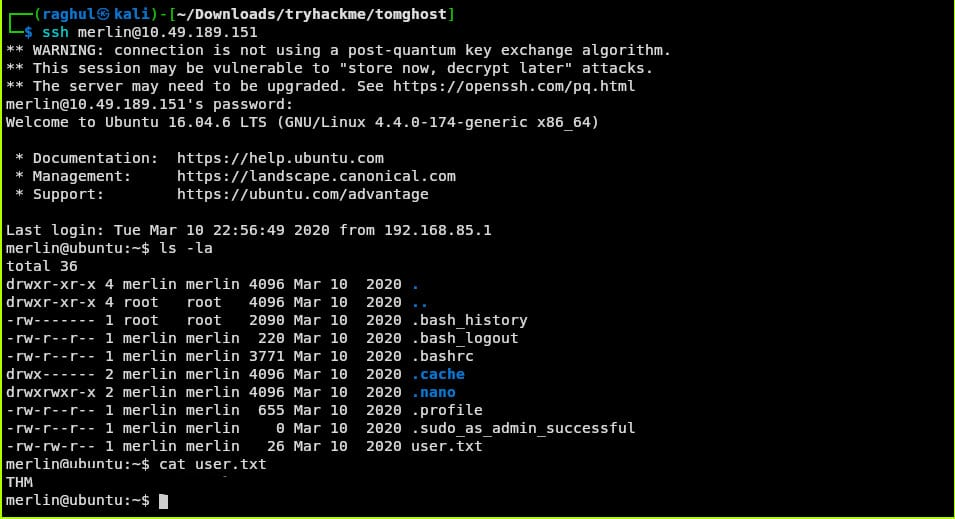

---

## Privilege Escalation

### Enumerating Sudo Permissions

A common privilege escalation check on Linux systems is reviewing the commands that can be executed through sudo.

```bash
sudo -l
```

**Figure 11: Sudo Privileges**

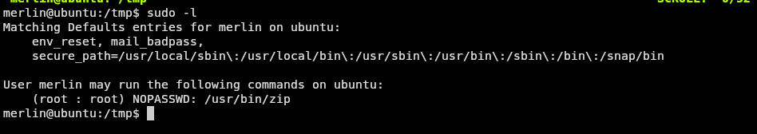

The output revealed that Merlin could execute:

```text
/usr/bin/zip
```

as root without supplying a password.

This immediately caught my attention because `zip` is listed in GTFOBins and can be abused for privilege escalation.

---

### Abusing Zip for Root Access

Consulting GTFOBins revealed that `zip` can execute arbitrary commands through its testing functionality.

The following command was used:

```bash
sudo zip /tmp/hi.zip /etc/hosts -T -TT '/bin/bash #'
```

**Figure 12: Zip Privilege Escalation**

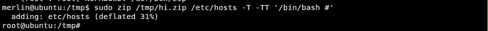

The `-T` (Test): This option tells zip to test the integrity of the archive it just created.

The `-TT` option allows a custom command to be supplied for testing archive integrity.

The `#` character comments out the remainder of the generated command, ensuring that Bash executes cleanly and returns a root shell.

After executing the command, a root shell was obtained successfully.

```text
uid=0(root)
```

---

### Root Flag

With root privileges acquired, the final flag was retrieved.

```bash
cat /root/root.txt
```

**Figure 13: Root Flag Retrieved**

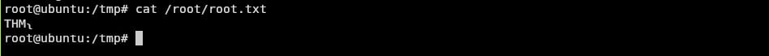

The machine was now fully compromised.

---

## Attack Path Summary

1. Enumerated services using Nmap.
2. Identified Apache Tomcat and exposed AJP service.
3. Researched Ghostcat (CVE-2020-1938).
4. Exploited Ghostcat using Metasploit.
5. Recovered Skyfuck's credentials.
6. Logged in through SSH.
7. Retrieved a GPG private key and encrypted credential file.
8. Cracked the GPG passphrase using John the Ripper.
9. Decrypted the credential file and recovered Merlin's credentials.
10. Logged in as Merlin.
11. Enumerated sudo permissions.
12. Abused Zip through GTFOBins.
13. Obtained a root shell.
14. Retrieved the root flag.

## Skills Practiced

* Service Enumeration
* Apache Tomcat Enumeration
* AJP Protocol Analysis
* Ghostcat Exploitation (CVE-2020-1938)
* Metasploit Usage
* SSH Access
* GPG Key Analysis
* Password Cracking with John the Ripper
* Linux Enumeration
* GTFOBins Privilege Escalation

## Lessons Learned

This room demonstrates the importance of:

* Restricting access to AJP services.
* Keeping Apache Tomcat installations patched.
* Protecting sensitive files and credentials.
* Using strong passphrases for encryption keys.
* Reviewing sudo permissions carefully.
* Auditing binaries that can be abused through GTFOBins.

The compromise of this machine was achieved through a chain of small weaknesses that ultimately resulted in full system compromise.
